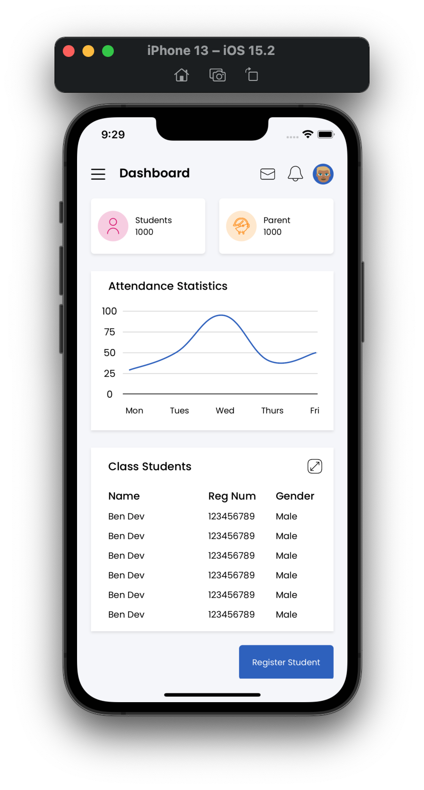
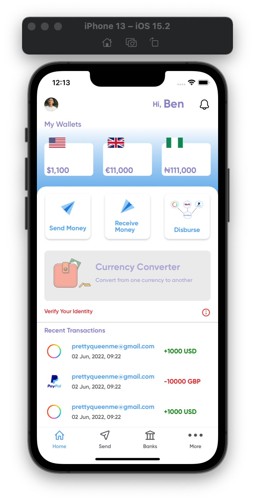
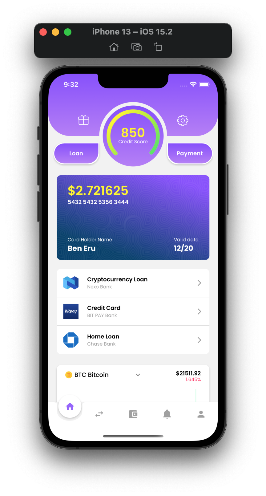

### Hi there 

Hello, I’m Benjamin, I build Android and iOS Applications with React Native  

- 🌱 I’m currently learning AI / Machine Learning
- 👯 I’m looking to collaborate with other React Native Developers
- 🥅 2022 Goals: To collaborate with as much developers as possible and increase my contributions to opensource 
- ⚡ Fun fact: I love music and pets

### Connect with me:

&nbsp;&nbsp;

&nbsp;&nbsp;

### Languages and Tools:

 
 

  

