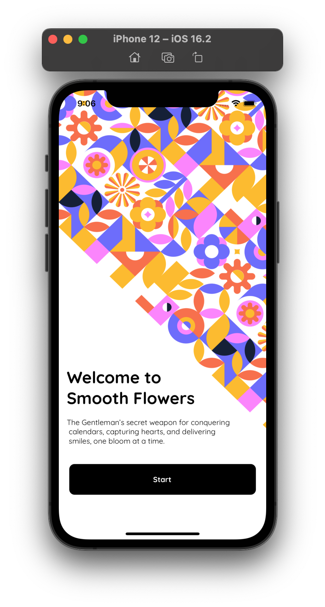
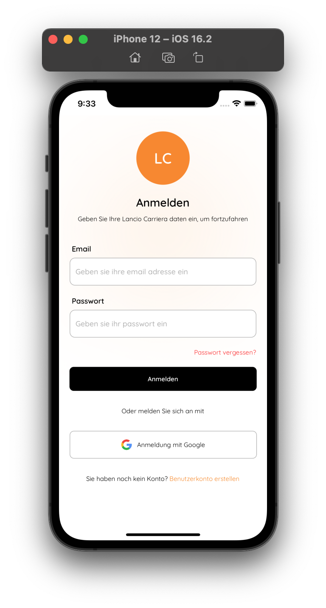

# Hi there 

Hello, I'm Benjamin, a passionate developer specializing in Android and iOS mobile applications built with React Native. My journey in the tech world has been an exciting one, and I'm constantly hungry to learn and grow. 

- 🌱 Currently, I'm on a quest to expand my knowledge in all things tech. Whether it's exploring new programming languages, diving into the latest frameworks, or discovering innovative development techniques, I'm eager to absorb it all.
- 👯 I'm actively seeking opportunities to collaborate with fellow React Native enthusiasts and professionals. Together, we can push the boundaries of mobile app development and create something extraordinary.
- ⚡  Fun fact: When I'm not immersed in code, you'll find me lost in the rhythm of music or showering love on adorable dogs.

Join me on this incredible journey of coding and exploration, where innovation knows no bounds. Let's connect, collaborate, and create the future together! 🚀

## Connect with me:

[][linkedin]
[][instagram]
[][twitter]

 
 

## Languages and Tools:

 

 
 

## Libraries and Frameworks Used:

 
 

## Databases I am familiar with:

 
 

## Recent Projects

  
  
 

 

 

[twitter]: https://twitter.com/benjamin_eru
[instagram]: https://instagram.com/benjamineruvieru
[linkedin]: https://www.linkedin.com/in/benjamineruvieru

